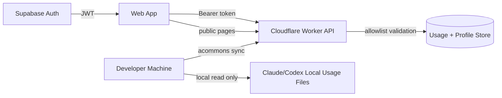

# 2026-02-18 Global Architecture and Privacy Plan

## Goal
Build a globally available token analytics product with strict privacy boundaries.

## Architecture
- CLI reads local Claude/Codex files and uploads daily model-level aggregates.
- Cloudflare Worker API validates allowlist payloads and serves leaderboard/profile data.
- Web app provides home, leaderboard, and profile pages.
- Supabase Auth/Postgres are supported through environment-based auth hooks.

## Architecture Diagram

## Privacy Contract
Allowed upload fields only:
- `date`, `source`, `model`
- `input_uncached`, `output`, `cached_read`, `cached_write`, `total_io`

Never uploaded:
- prompts/messages, file paths, repo names, raw sessions.

## Public Interfaces
- `POST /v1/usage/daily`
- `GET /v1/public/leaderboard?period=24h|7d|all`
- `GET /v1/public/profile/:handle`
- `GET/PATCH /v1/me/profile`
- `PATCH /v1/me/privacy`
- `GET /v1/me/usage`
- `POST /v1/me/export`
- `DELETE /v1/me/data`

## Testing and Acceptance
- API rejects non-allowlist fields.
- Privacy toggle removes user from public leaderboard.
- Leaderboard supports 24h, 7d, and all-time windows.
- Profile data is visible at `/u/:handle` and editable via `/me`.

